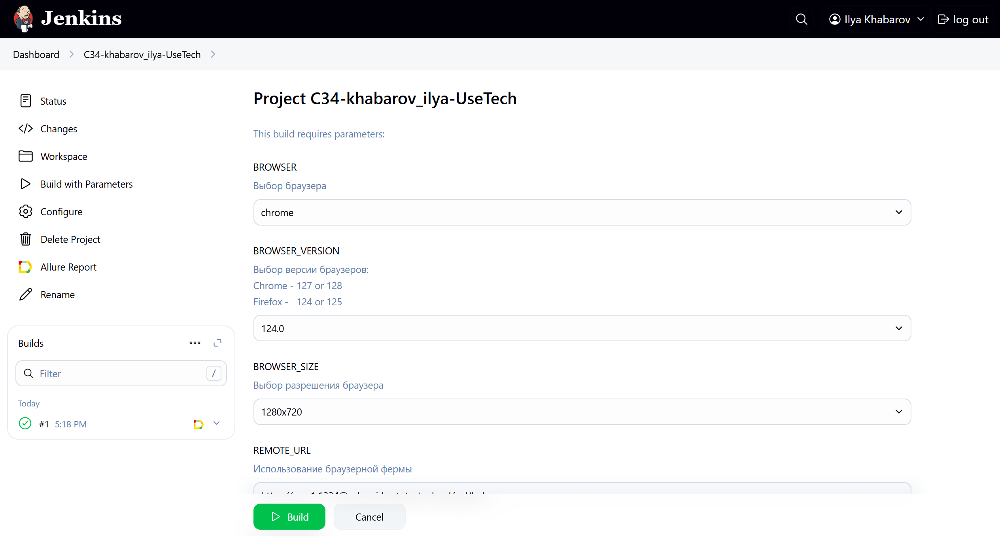
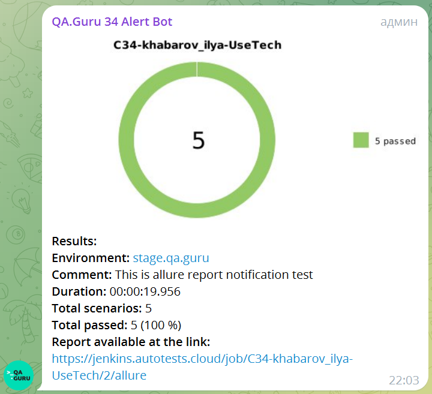
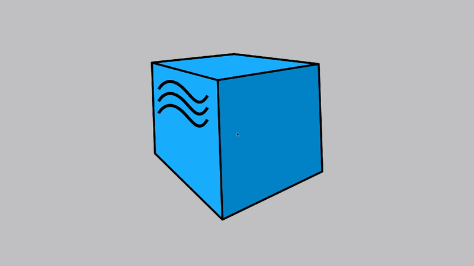

<p align="center">

</p>

# Проект по автоматизации тестовых сценариев для сайта компании [Usetech](https://usetech.ru/)

## 📜 Содержание

- [Используемый стек](#computer-используемый-стек)
- [Реализованные проверки](#-реализованные-проверки)
- [Запуск автотестов](#️-запуск-автотестов)
- [Запуск тестов из терминала](#запуск-тестов-из-терминала)
- [Сборка в Jenkins](#-сборка-в-jenkins)
- [Пример Allure-отчета](#-пример-allure-отчета)
- [Overview](#overview)
- [Уведомления в Telegram с использованием бота](#-уведомления-в-telegram-с-использованием-бота)
- [Видео примера запуска тестов в Selenoid](#-видео-примера-запуска-тестов-в-selenoid)

## :computer: Используемый стек

| Java                                                                                                                 | IntelliJ  <br>  Idea                                                                                                                    | GitHub                                                                                                                       | JUnit 5                                                                                                    | Gradle                                                                                                     | Selenide                                                                                                   | Selenoid                                                                                                            | Allure <br> Report                                                                                                  |  Jenkins                                                                                                 |   Telegram
|:---------------------------------------------------------------------------------------------------------------------|-----------------------------------------------------------------------------------------------------------------------------------------|------------------------------------------------------------------------------------------------------------------------------|------------------------------------------------------------------------------------------------------------|------------------------------------------------------------------------------------------------------------|------------------------------------------------------------------------------------------------------------|---------------------------------------------------------------------------------------------------------------------|---------------------------------------------------------------------------------------------------------------------|----------------------------------------------------------------------------------------------------------|--------------------------------------------------------------------------------------------------------------|
| <a href="https://www.java.com/"></a> | <a href="https://www.jetbrains.com/idea/"></a> | <a href="https://github.com/"></a> | <a href="https://junit.org/junit5/"></a> | <a href="https://gradle.org/"></a> | <a href="https://selenide.org/"></a> | <a href="https://aerokube.com/selenoid/"></a> | <a href="https://github.com/allure-framework"></a> |<a href="https://www.jenkins.io/"></a> | <a href="https://web.telegram.org/"></a> |<a href="https://qameta.io/"></a> |


Тесты в данном проекте написаны на языке <code>Java</code> с использованием фреймворка для
тестирования [Selenide](https://selenide.org/), сборщик - <code>Gradle</code>. <code>JUnit 5</code> задействован в
качестве фреймворка модульного тестирования.
При прогоне тестов для запуска браузеров используется [Selenoid](https://aerokube.com/selenoid/).
Для удаленного запуска реализована джоба в <code>Jenkins</code> с формированием Allure-отчета и отправкой результатов
в <code>Telegram</code> при помощи бота.

Содержание Allure-отчета:

* Шаги теста;
* Скриншот страницы на последнем шаге;
* Page Source;
* Логи браузерной консоли;
* Видео выполнения автотеста.

## 🔽 Реализованные проверки

* Проверка заголовков главной страницы
* Проверка перехода с главной страницы на страницу "Награды"
* Проверка перехода с главной страницы на страницу "Контакты"
* Проверка перехода с главной страницы на страницу "Новости"
* Проверка перехода с главной страницы на страницу "Отрасли"

## 🔽 Запуск автотестов

### Запуск тестов из терминала

```
gradle clean UsetechDemoTests -Dselenoid_url="selenoid.autotests.cloud/wd/hub" -Dbrowser_size="1920х1080" -Dbrowser="chrome" -Dbrowser_version="100.0"
```

При выполнении данной команды в терминале IDE тесты запустятся удаленно в <code>Selenoid</code>.

##  Сборка в [Jenkins](https://jenkins.autotests.cloud/job/C34-khabarov_ilya-UseTech/)

Для запуска сборки необходимо перейти в раздел <code>Buld with parameters</code>, выбрать нужные параметры запуска
автотестов и нажать кнопку <code>Build</code>.
<p align="center">

</p>
После выполнения сборки, в блоке <code>Builds</code> напротив номера сборки появятся значки <code>Allure Report</code> и <code>Allure TestOps</code>, при клике на которые откроется страница со сформированным html-отчетом и тестовой документацией соответственно.

##  Пример [Allure-отчета](https://jenkins.autotests.cloud/job/C34-khabarov_ilya-UseTech/2/allure)

<p align="center">

</p>

##  Уведомления в Telegram с использованием бота

После завершения сборки специальный бот, созданный в <code>Telegram</code>, автоматически обрабатывает и отправляет
сообщение с отчетом о прогоне тестов.

<p align="center">

</p>

##  Видео примера запуска тестов в Selenoid

В отчетах Allure для каждого теста прикреплен не только скриншот, но и видео прохождения теста
<p align="center">
  
</p>
